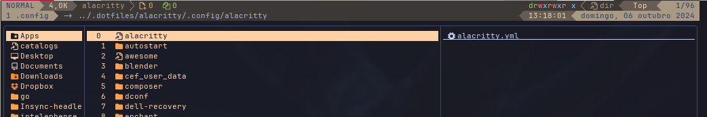

# yatline-symlink.yazi

An addon to show symlink target in your [yatline.yazi](https://github.com/imsi32/yatline.yazi)'s status or header line.



## Requirements

- Yazi 26.5.6 or newer
- [yatline.yazi](https://github.com/imsi32/yatline.yazi)

## Installation

```sh
ya pkg add lpanebr/yazi-plugins:yatline-symlink
```

## Usage

> [!IMPORTANT]
> Add this to your `~/.config/yazi/init.lua` after yatline.yazi's initialization.

```lua
require("yatline-symlink"):setup()
```

Then, add it in one of your sections in the yatline configuration using:

```lua
{ type = "coloreds", custom = false, name = "symlink" }
```

**Optional configuration:**

```lua
require("yatline-symlink"):setup({
  symlink_color = "white"
}
```

## Disclaimers

- Since 2026, all parts of this plugin are edited with AI coding tools such as Codex. All changes remain under my supervision and are reviewed and tested by me before release.
